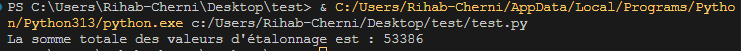

# Vayetek-Test-Technique

---

## Question 1: Extraction des valeurs d'étalonnage

### Résultat
La somme totale des valeurs d'étalonnage est : **53386**

---

## Question 2: SQL Murder Mystery

### Résultat
Le meurtrier est **'Jeremy Bowers'**, mais le véritable méchant est **'Miranda Priestly'**.

